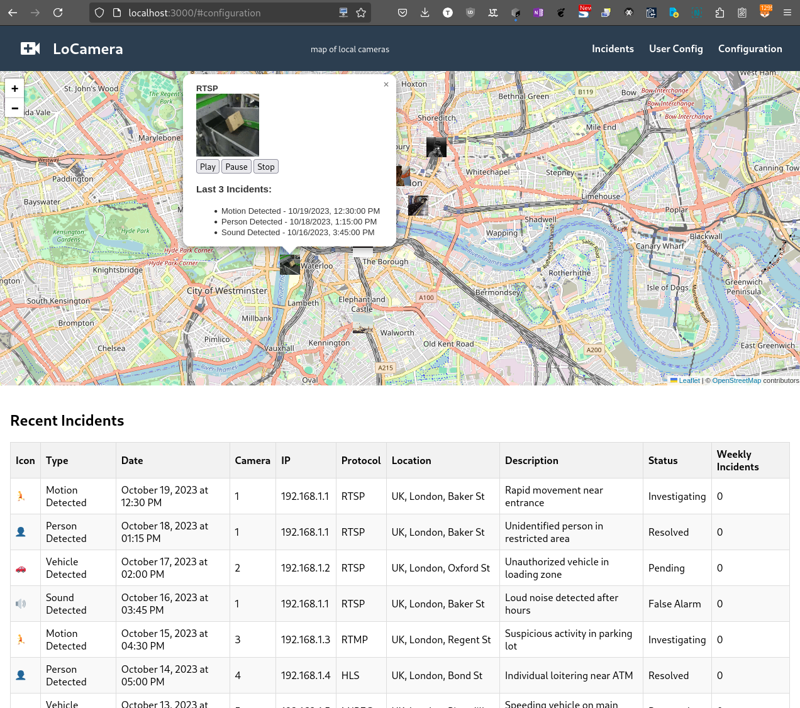

# LoCamera - Local Cameras on the Map

LoCamera is a web application that displays local cameras on an interactive map. It allows users to view camera locations, their live streams, and recent incidents.

## Features

- Interactive map displaying camera locations
- Camera information on hover
- Live stream playback controls
- Recent incidents display for each camera
- User registration and login with ReCAPTCHA
- Camera and incident management interfaces
- Dockerized application for easy deployment
- HTTPS support for secure connections
- Responsive design for mobile and desktop

## Technologies Used

- Frontend: React, Leaflet
- Backend: Node.js, Express
- Authentication: JWT, bcrypt
- Database: (To be implemented)
- Containerization: Docker, Docker Compose
- CI/CD: GitLab CI
- SSL: Let's Encrypt (Production), Self-signed (Development)

## Getting Started

### Prerequisites

- Node.js (v14 or later)
- Docker and Docker Compose
- Git

### Installation

1. Clone the repository:
   ```
   git clone https://gitlab.com/your-username/locamera.git
   cd locamera
   ```

2. Set up environment variables:
   - Copy `.env.example` to `.env` and fill in the necessary values.

3. Use the management script to set up and run the application:
   ```
   chmod +x manage-locamera.sh
   ./manage-locamera.sh
   ```

4. Choose the appropriate option from the menu to start the application.

## Development

- To start the development environment with HTTP:
  ```
  ./manage-locamera.sh
  ```
  Then select option 1 from the menu.

- To start the development environment with HTTPS:
  ```
  ./manage-locamera.sh
  ```
  Then select option 2 from the menu.

## Deployment

The project includes a `.gitlab-ci.yml` file for GitLab CI/CD. To deploy:

1. Push your changes to the GitLab repository.
2. The pipeline will automatically build, test, and deploy the application.

For manual deployment, use the management script and select the "Start production environment" option.

## Contributing

Please read [CONTRIBUTING.md](CONTRIBUTING.md) for details on our code of conduct and the process for submitting pull requests.

## License

This project is licensed under the Apache License - see the [LICENSE](LICENSE) file for details.

## Acknowledgments

- OpenStreetMap for providing map data
- Leaflet.js for the interactive map functionality

## backend
Files structure
```
locamera/
├── api/
│   └── index.js
├── nginx/
│   └── nginx.conf
├── public/
│   └── index.html
├── src/
│   ├── components/
│   │   └── Map.js
│   ├── App.js
│   └── index.css
│   └── index.js
├── .env
├── Dockerfile
├── docker-compose.yml
├── package.json
└── README.md
```


## frontend
react

```
src/
├── components/
│   ├── Header.js
│   └── Map.js
├── styles/
│   ├── App.css
│   └── Header.css
├── App.js
└── index.js
public/
└── logo.svg
```



